# AI Prompt Assistant - Flutter Desktop App

A powerful Flutter desktop application for analyzing images and videos using multiple AI vision models. Convert the original Python/Streamlit image-to-prompt application to a native desktop experience.

**[Try Online Demo](https://ai-prompt-assistant-web.vercel.app/)**

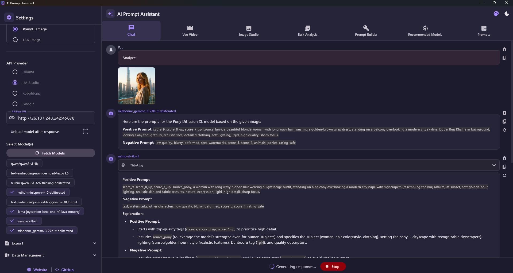

## What's New in v1.2.0
- **Free Provider (g4f.space)** - New zero-config cloud provider. No API key needed. Choose from Groq, Ollama, Pollinations, Nvidia, and Gemini routes via the public G4F relay.
- **Searchable Model Picker** - The Free provider replaces chip selection with a live-search list so you can quickly find models from large route catalogs.
- **Free Provider is Now Default** - New installs open with the Free provider selected so users can start chatting immediately.
- **Gemma 4 in Local Enhancer** - Added **Gemma 4 E4B** and **Gemma 4 26B A4B** as built-in Local Enhancer models.
- **PromptFill Template Studio** - Added the native PromptFill workflow for browsing, editing, and filling structured prompt templates directly inside the desktop app.

For a release-focused summary, see [WHATS_NEW.md](WHATS_NEW.md).

## Features

### Multi-Provider Support
- **Free (g4f.space)** - Zero-configuration cloud provider via the public G4F relay — no API key required. Choose from Groq, Ollama, Pollinations, Nvidia, and Gemini routes with a searchable model picker
- **Ollama** - Local model hosting with keep-alive configuration
- **LM Studio** - Local OpenAI-compatible API with model unloading
- **Koboldcpp** - Local inference server
- **Google Gemini** - Cloud API with image and video support
- **Veo Video Generation** - Powered by Google Video FX for professional cinematic results
- **Image Studio** - High-quality image generation using Gemini 3 and Imagen 4 models
- **Local Enhancer** - Self-contained LLM prompt enhancer for Wan2.1 image and video generation. No third-party software required — the backend is bundled with the app, and Gemma GGUF runtime support is bootstrapped automatically on first use

### Image Studio (Generation & Editing)
- **Text to Image** - Create stunning visuals from descriptive prompts
- **Image to Image** - Use reference images to guide style, composition, and content
- **"Surprise Me"** - One-click creative prompt generation for both text-to-image and editing workflows
- **"Use as Reference"** - Instantly use any generated image as a starting point for further variations
- **Advanced Resolution** - Select between 1K, 2K, and 4K output (model dependent)
- **Aspect Ratio Control** - Standard 1:1, Landscape 16:9, or Portrait 9:16 support
- **Model Support** - Integrated Gemini 3 Pro, Gemini 2.5 Flash, and Imagen 4 models

### Image Studio Generation

1. **Switch to Image Studio Tab** in the sidebar
2. **Select Model**: Choose between Imagen 4, Gemini 3 Pro (preview), or Gemini 2.5 Flash
3. **Configure Settings**: Select Aspect Ratio and Resolution (1K/2K/4K for Pro models)
4. **Choose Mode**:
   - *Text to Image*: Enter a prompt or use 🎲 **Surprise Me** for inspiration
   - *Image to Image*: Attach a reference image or use ↺ **Use as Reference** on a previously generated image
5. **Improve Prompt**: Use the ✨ wand icon to have an LLM enhance your base prompt for better results
6. **Generate**: Click the Send icon to start generation

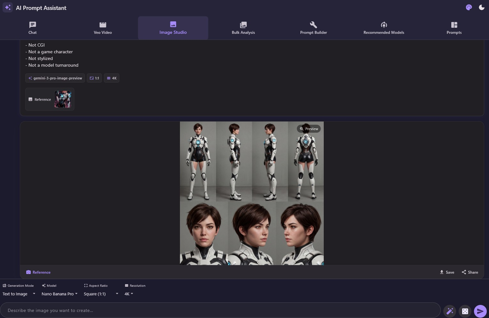

### Veo Video Generation
- **Text to Video** - Generate high-quality cinematic videos from text prompts
- **Image to Video** - Use start and end images to guide video generation
- **Extend Video** - Automatically extend existing videos by extracting the last frame and generating a continuation, then seamlessly merging them with FFmpeg
- **Prompt Enhancement** - Built-in LLM-powered rewriter that uses attached images and video frames to create highly detailed cinematic prompts
- **Audio-Aware Video Prompting** - Local Enhancer video modes can now use speech, ambience, music, and sound effects from attached videos to generate richer prompts
- **Advanced Controls** - Configure aspect ratio (16:9, 9:16) and resolution (720p, 1080p, 4K)
- **FFmpeg Integration** - Automatic downloading and configuration of FFmpeg for complex video operations (Windows auto-download)

### SVG Generator
- **Text to SVG** - Describe any object, icon, or scene and generate a fully self-contained SVG vector graphic
- **Animated SVG** - Toggle to Animated mode to produce CSS-animated SVGs with looping `@keyframes` effects
- **Reference Image** - Attach an image as a visual reference; the AI recreates it in vector format
- **Multi-Provider** - Works with the API provider selected in the sidebar (Google Gemini, Ollama, LM Studio, Koboldcpp)
- **Export Options** - Download as SVG, PNG, GIF, Animated PNG (APNG), MP4 (H.264), or MOV (lossless)
- **Browser Preview** - Open animated SVGs in the system browser for full CSS animation playback

### PromptFill Template Studio
- **Native PromptFill Workflow** - Browse, edit, and fill structured prompt templates directly inside the desktop app
- **Complete PromptFill Dataset** - Includes all imported categories, banks, and templates from the original app, normalized to English-only labels and content
- **Inline Variable Editing** - Click any variable chip in a template to pick from bank terms, local options, or add a custom value
- **Smart Terms** - Generate context-aware variable suggestions with AI inside the variable picker dialog
- **AI Smart Split** - Convert a plain prompt into a reusable variable-based template using the current chat model
- **Template Media Types** - Switch templates between image and video modes with a built-in type selector
- **Image and Video Preview** - Templates support cover images and inline video preview for original video templates
- **Large Image Lightbox** - Click a template preview image to open a large zoomable preview
- **Template Media Editing** - Set network URLs, local cover images, and video preview URLs directly from the editor

> **PromptFill support is adapted from [Prompt Fill](https://github.com/TanShilongMario/PromptFill) by
> [@TanShilongMario](https://github.com/TanShilongMario).** This desktop app ports the structured template workflow, imported data, and media-preview concepts into the native Flutter experience.

### Core Capabilities
- **Multi-Model Execution** - Run queries against multiple models simultaneously
- **Image Analysis** - Upload and analyze multiple images with drag-and-drop support
- **Video Analysis** - Full Google Files API integration with resumable uploads (Google only)
- **Chat Interface** - Conversation-based interaction with streaming responses
- **Bulk Analysis** - Batch process entire folders of images
- **System Prompt Builder** - Generate prompts with 11 caption types, 30 length options, and 25 extra options
- **Prompt Director Pro** - AI image/video prompt writing helper with model-aware dropdowns for style, camera, lighting, composition, and video movement
- **PromptFill Template Authoring** - Build reusable prompt systems with banks, variables, template tags, and media previews
- **Conversation Management** - Save, load, rename, delete, and move conversations to folders
- **Conversation Folders** - Organize chats in a nested folder tree with subfolder support
- **Conversation Search** - Real-time search with debounce across all saved conversations
- **Export** - Export conversations to TXT or JSON format
- **Nano Banana Prompt Library** - Curated prompt gallery with search, category filters, image thumbnails, and one-click copy or send-to-Image-Studio
- **Theme Customization** - Multiple color palettes with light / dark / system mode toggle

### Local Enhancer
- **No Setup Required** - The Wan2.1 prompt-enhancement backend is bundled inside the app. No Ollama, no Python installation, no third-party tools needed.
- **Built-In Model Catalog** - Florence2 + LLaMA 3.2, Florence2 + LLaMA JoyCaption, Qwen3.5-4B Abliterated, Qwen3.5-9B Abliterated, Gemma 4 E4B, and Gemma 4 26B A4B.
- **Auto Mode Detection** - Automatically picks the right enhancement mode (T2V, I2V, V2V, I2I, etc.) based on what media you have attached and your chosen output type.
- **Auto System Prompt** - Global toggle that selects the optimal system prompt for each mode automatically, or lets you choose a custom prompt manually.
- **Generation Output Type** - Choose Image or Video output; the enhancer adjusts its prompt style accordingly.
- **11 Enhancement Modes** - T2V, T2I, T2T, I2V, IT2V, I2I, IT2I, V2V, VT2V, V2I, VT2I — covering all text, image, and video input combinations.
- **Quantization Backends** - Qwen models support GGUF and Quanto INT8. Gemma models are GGUF-only.
- **Configurable LLM Parameters** - Adjust max tokens, temperature, top-p, and seed from the Local Enhancer Settings dialog.
- **Gemma Runtime Bootstrap** - Gemma models automatically download a compatible pinned `llama.cpp` runtime the first time they are loaded.
- **Audio Understanding for Video Modes** - In Qwen video modes (V2V, VT2V, V2I, VT2I), the enhancer analyzes attached video audio locally with Whisper + CLAP and can incorporate dialogue, ambience, music, and sound effects into the rewritten prompt.
- **Graceful Fallback** - If a video has no audio, or if local audio analysis fails, Local Enhancer automatically falls back to visual-only prompting instead of failing the request.
- **Auto-Launch / Auto-Stop** - Backend starts automatically when you select the provider and shuts down when you switch away.

> **Based on [Wan2GP](https://github.com/deepbeepmeep/Wan2GP) by
> [@deepbeepmeep](https://github.com/deepbeepmeep).** This repository packages only
> the prompt-enhancement component with a fully automated Windows setup.

### System Prompt Builder
- **11 Caption Types**: Descriptive, Stable Diffusion, MidJourney, Danbooru tags, Art Critic, Product Listing, Social Media, and more
- **30 Length Options**: From "Very Short" (20-40 words) to "260 words", plus custom word counts
- **25 Extra Options**: Control ethnicity/gender, lighting, camera details, watermarks, aesthetic quality, and more
- **57 Predefined Prompts**: Built-in prompts for video formats (Wan2.1, LTX-2), image editing (FLUX, Qwen), tagging (Danbooru, PonyXL), various photography styles, and a dedicated **Wan2GP Modes** category covering all 11 enhancement modes used by Local Enhancer

### Prompt to JSON Pipeline
- **Two-Step AI Enhancement** - Advanced pipeline that converts simple casual text prompts into highly structured JSON payloads.
- **Dynamic Field Selection** - Automatically analyzes your input to determine which specific fields are relevant (e.g., camera movement, lighting, wardrobe, audio, temporal flow).
- **Master Prompt Generation** - Synthesizes all selected variables into a cohesive, highly descriptive `master_prompt` paragraph perfect for advanced models.
- **Provider Agnostic** - Runs on whichever model and API provider you have currently selected in the sidebar.
- **Generation Integration** - Integrated directly into generation screens (e.g., Veo Video generation via the "JSON Enhance" button), turning simple ideas into cinematic, parameter-rich JSON objects.

### Prompt Director Pro
A built-in prompt writing helper (inspired by AILTC Prompt Director) accessible from the chat input area via the ✨ magic wand button. Supports 9 AI models across image and video generation:

- **9 AI Models**: Flux, Midjourney 7, Nano Banana, SeeDream 4, Z-Image, Qwen, Wan 2.2/2.1 Video, LTX-2 Video
- **Model-Aware Sections**: Each model shows only its relevant controls — image models show camera/composition, video models add movement/pacing
- **6 Control Sections**: Style & Look (art style, film look, color palette, texture), World & Environment, Camera Gear (body, focal length, format, lens, aperture), Composition (shot size, angle), Lighting & Mood, Video Movement (relation, camera movement, pacing)
- **Randomize**: One-click randomization of all visible settings for creative inspiration
- **Live Preview**: See the assembled prompt in real-time before inserting it into the chat
- **Direct Integration**: Generated prompts are inserted directly into the message input box

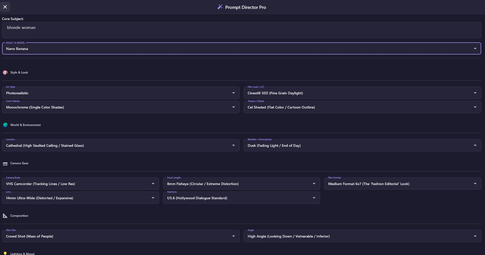

## Installation for Users

1. **Open the latest release**
   - Download the newest package from [GitHub Releases](https://github.com/rorsaeed/ai-prompt-assistant-pro/releases).

2. **Choose the Windows package you want**
   - `Installer_Win_X64.exe` for the normal installer experience
   - `ai_prompt_assistant.zip` for a portable build you can extract and run manually

3. **Install or extract**
   - If you downloaded the installer, run it and follow the setup steps.
   - If you downloaded the ZIP, extract it to a folder of your choice and launch `ai_prompt_assistant.exe`.

4. **Start using the app**
   - The `Free (g4f.space)` provider works without an API key.
   - Google Gemini still requires your own API key.
   - Local Enhancer is bundled with the app, but first use may trigger one-time runtime or model downloads.

## Installation for Developers

### Prerequisites
- Flutter SDK 3.0 or later
- Windows, macOS, or Linux desktop platform
- For local models: Ollama, LM Studio, or Koboldcpp installed and running
- For Google Gemini: API key from [Google AI Studio](https://aistudio.google.com/app/api-keys)
- **Local Enhancer**: No prerequisites — the backend is fully bundled with the app
  - First use of Qwen video modes may trigger a one-time local download of additional audio-analysis models.
  - First use of Gemma models may trigger a one-time local download of the pinned `llama.cpp` runtime.

### Setup

1. **Clone the repository**
   ```bash
   git clone https://github.com/rorsaeed/ai-prompt-assistant-pro.git
   cd ai-prompt-assistant-pro
   ```

2. **Install dependencies**
   ```bash
   flutter pub get
   ```

3. **Run the app**
   ```bash
   # Windows
   flutter run -d windows

   # macOS
   flutter run -d macos

   # Linux
   flutter run -d linux
   ```

4. **Build release version**
   ```bash
   flutter build windows
   flutter build macos
   flutter build linux
   ```

## Usage

### First Time Setup

1. **Open the sidebar** (hamburger menu icon)
2. **Select API Provider** (Ollama, LM Studio, Koboldcpp, or Google)
3. **Configure provider settings**:
   - For local providers: Set API base URL (default ports: Ollama=11434, LM Studio=1234, Koboldcpp=5001)
   - For Google: Enter API key
4. **Fetch models** using the "Fetch Models" button
5. **Select one or more models** from the available list
6. **Choose or create a system prompt**

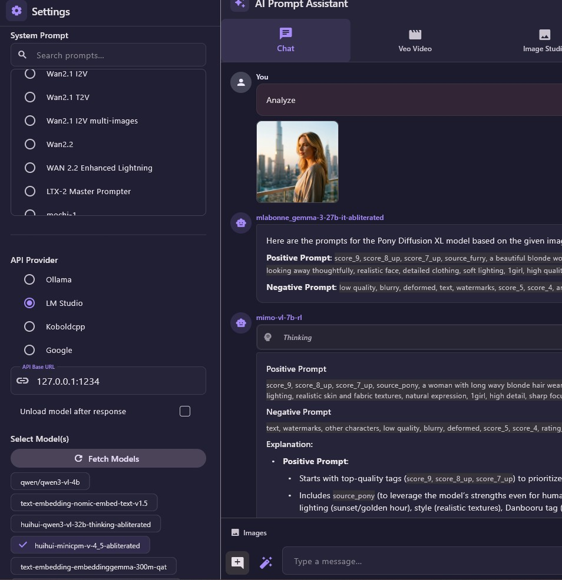

### Chat Interface

1. **Upload images** (optional): Click "Add Images" or drag-and-drop
2. **Upload videos** (Google only): Click "Add Videos"
3. **Enter your message** or click "Analyze Image(s)" for media-only analysis
4. **View streaming responses** from all selected models simultaneously
6. **Open Prompt Director** (✨ wand icon next to message box) to build image/video prompts with guided dropdowns
7. **Regenerate** any response by clicking the refresh icon
6. **Delete** messages using the × button

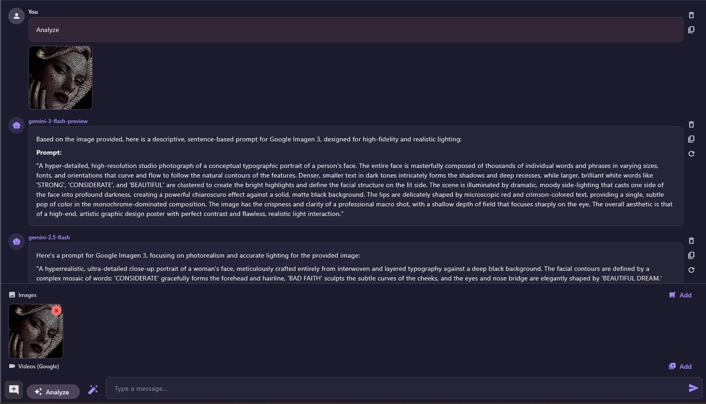

### Local Enhancer

1. **Select "Local Enhancer"** in the API Provider list in the sidebar — the backend starts automatically
2. **Open Local Enhancer Settings** (gear icon) to configure the model backend, LLM parameters, and seed
3. **Enable Auto System Prompt** (toggle in the sidebar) to let the app pick the best system prompt based on your attached media and output type, or disable it to use your own custom prompt
4. **Select Output Type** (Image or Video) in the sidebar when Auto System Prompt is on
5. **Attach media** (optional): images or videos — the mode is auto-detected from what you attach
6. **For video attachments in Qwen models**, Local Enhancer analyzes both visuals and audio. Short dialogue, ambience, music, and sound effects may be reflected in the rewritten prompt when relevant.
7. **Enter a prompt** and send — the enhancer rewrites it into a detailed Wan2.1-optimised prompt
8. **Switch away** from Local Enhancer to automatically shut down the backend

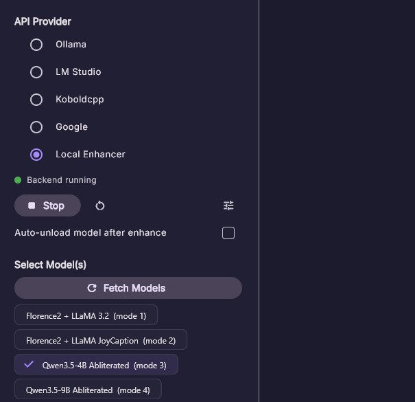

#### Testing Audio-Aware Video Prompting

1. Select **Local Enhancer** and choose **Qwen3.5-4B Abliterated** or **Qwen3.5-9B Abliterated**.
2. Attach a short video with clear speech and/or obvious background audio.
3. Send either:
   - `analyze` for pure video analysis, or
   - a normal instruction such as `Rewrite this into a cinematic prompt while preserving the dialogue and ambience`
4. Verify that the returned prompt includes:
   - visual scene details
   - spoken content when present
   - ambience, music, or sound effects when present
5. Silent videos should still work and should fall back to visual-only prompting.

### Veo Video Generation

1. **Switch to Veo Tab** in the sidebar
2. **Select Generation Mode**: Text to Video, Frame to Video, or Extend Video
3. **Configure Settings**: Choose aspect ratio (Landscape/Portrait) and Resolution
4. **Attach Media**: Click "Attach Media" or drag-and-drop images/videos.
   - *Frame to Video*: Add a Start Frame and/or End Frame image.
   - *Extend Video*: Add an Input Video.
5. **Enhance Prompt**: Click the ✨ wand icon in the input bar to have an LLM rewrite your prompt based on your text and any attached media (extracted frames are used for videos).
6. **Generate**: Click the Send icon to start the generation process.
7. **Extend Existing Videos**: Use the "Extend" button on any generated video bubble to automatically load it into the input for continuation.

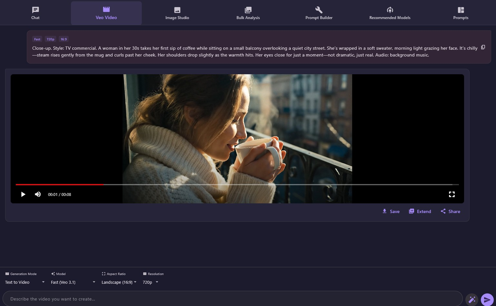

### Bulk Analysis

1. **Select a folder** containing images (.png, .jpg, .jpeg, .webp)
2. **Choose system prompt** from the sidebar
3. **Enable "Save prompts to text file"** to save results alongside images
4. **Click "Analyze All Images"** to process the entire folder
5. **View progress** and results in the grid layout

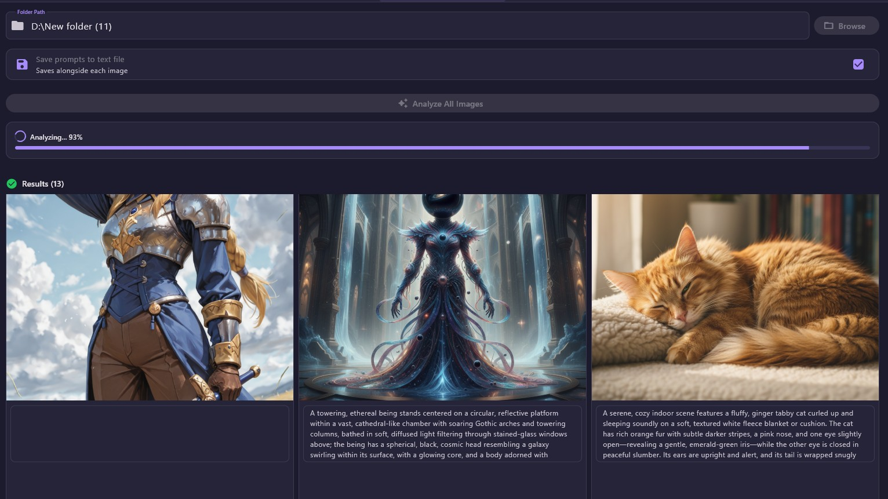

### System Prompt Builder

1. **Open the sidebar** and expand "System Prompt Builder"
2. **Select caption type** (e.g., "Stable Diffusion Prompt")
3. **Choose caption length** (e.g., "Long" or "150 words")
4. **Enable extra options** (e.g., "Include lighting info", "No ethnicity")
5. **If using NAME_OPTION**: Enter the specific name for people in images
6. **Click "Generate and Apply Prompt"** to build and apply the prompt
7. **Save custom prompts** with a unique name for later reuse

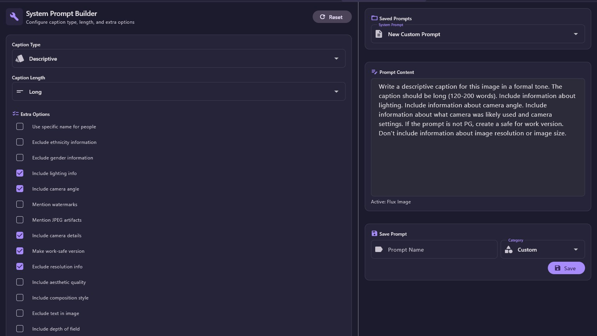

### Conversation Management

- **New Chat**: Click "New Chat" button to start fresh
- **Load Chat**: Select from the conversation tree in the sidebar
- **Rename Chat**: Right-click (⋮ menu) on a conversation → Rename
- **Delete Chat**: Right-click (⋮ menu) on a conversation → Delete
- **Move Chat**: Right-click (⋮ menu) on a conversation → Move to Folder
- **Export**: Use "to .txt" or "to .json" buttons to export current conversation
- **Search**: Use the search box at the top of the sidebar to filter conversations

### Conversation Folders

- **Create Folder**: Click the folder icon in the sidebar
- **Subfolders**: Right-click a folder → New Subfolder for nested organization
- **Rename / Delete Folder**: Right-click (⋮ menu) on any folder
- **Expand / Collapse**: Click a folder to toggle its contents

### SVG Generator

1. **Switch to the SVG Tab** in the top navigation bar
2. **Select provider and model** in the sidebar — the generator uses whichever API provider and model are currently selected
3. **Choose Mode**:
   - *Static*: Generates a clean, detailed flat-art vector graphic
   - *Animated*: Adds CSS `@keyframes` animations inside the SVG for looping effects
4. **Attach Reference Image** (optional): Click the image icon to upload a photo — the AI will recreate it as an SVG
5. **Describe your subject**: Type a description (e.g., "Space Rocket", "Isometric House", "Cyberpunk Helmet") or pick a quick suggestion chip
6. **Generate**: Click the Send icon or press Enter
7. **Export the result** using the toolbar on each generated card:
   - **Copy** SVG source code to clipboard
   - **Download** as `.svg`
   - **Export** as PNG, GIF, Animated PNG, MP4, or MOV via the export menu
   - **Play in Browser** (animated SVGs) — opens a full-screen HTML preview in your default browser

> **Tip**: For animated SVGs, use the Play in Browser button for the smoothest preview. In-app animated rendering requires the Windows WebView2 runtime.

1. **Access the Pipeline**: The Prompt to JSON pipeline is integrated into generation screens, such as the Veo Video tab. Look for the **JSON Enhance** button.
2. **Enter a Simple Prompt**: Type a basic concept or idea into the text input.
3. **Execute Pipeline**: Click the **JSON Enhance** button.
4. **Step 1 (Field Selection)**: The AI automatically determines which JSON fields (e.g., `camera_movement`, `lighting`, `color_palette`) are needed for your specific idea.
5. **Step 2 (Generation)**: The AI populates those specific fields and generates a comprehensive `master_prompt`.
6. **Review & Use**: The highly structured parameter payload is returned and ready to be used as a detailed prompt for high-end generation models.

<video src="https://github.com/user-attachments/assets/cf5137a5-f3d8-4425-87f9-7f7009b4cd61" controls width="100%"></video>

### Nano Banana Prompt Library

1. **Switch to the Prompts Tab** in the top navigation bar
2. **Browse or Search** prompts by title, description, or content using the search bar
3. **Filter by Category** using the group chips (e.g., Portrait, Landscape, Abstract)
4. **Copy Prompt**: Click **Copy Prompt** on any card to copy it to clipboard
5. **Use Image**: Click **Use Image** to download the reference image and open it directly in Image Studio with the prompt pre-filled
6. **Preview**: Click any card to open a full detail dialog with zoom support

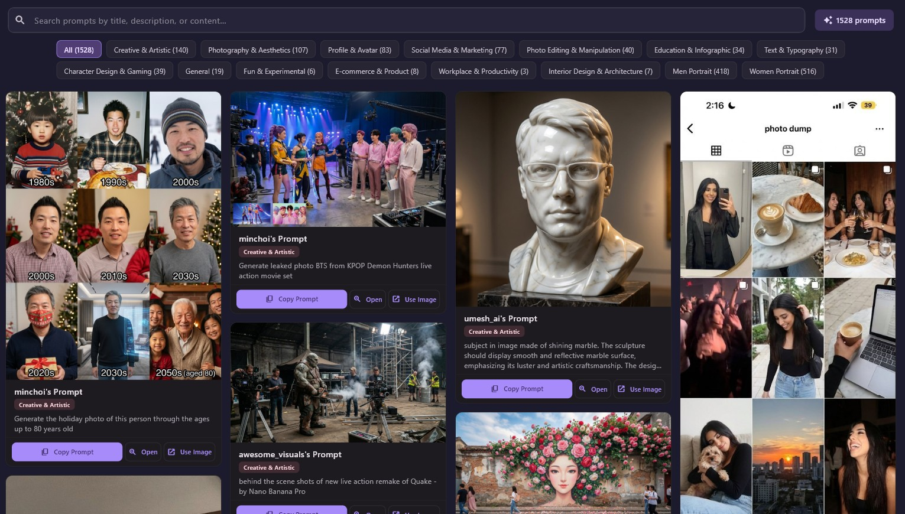

### PromptFill

1. **Switch to the PromptFill tab** in the top navigation bar
2. **Browse templates** by search, type, and tag filters in the left sidebar
3. **Select a template** to open it in the visual editor
4. **Fill variables** by clicking any inline chip in the template body
5. **Use Smart Terms** in the picker dialog to generate AI suggestions for the current variable in the context of the full template
6. **Add custom values** when no existing bank option fits your use case
7. **Edit template content** with the Edit button to work directly with raw `{{variable}}` placeholders
8. **Use AI Smart Split** from the AI tools menu to turn a plain prompt into a reusable template with extracted variables
9. **Manage template preview media** from the preview panel:
   - switch the template between **Image** and **Video** type
   - set or replace the cover image from a local file or URL
   - set the video preview URL for video templates
   - click the cover image to open a large zoomable preview
10. **Preview original video templates** inline in the editor when a template includes a saved `videoUrl`

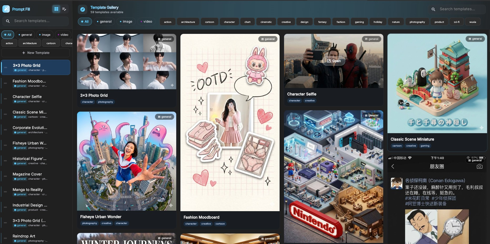
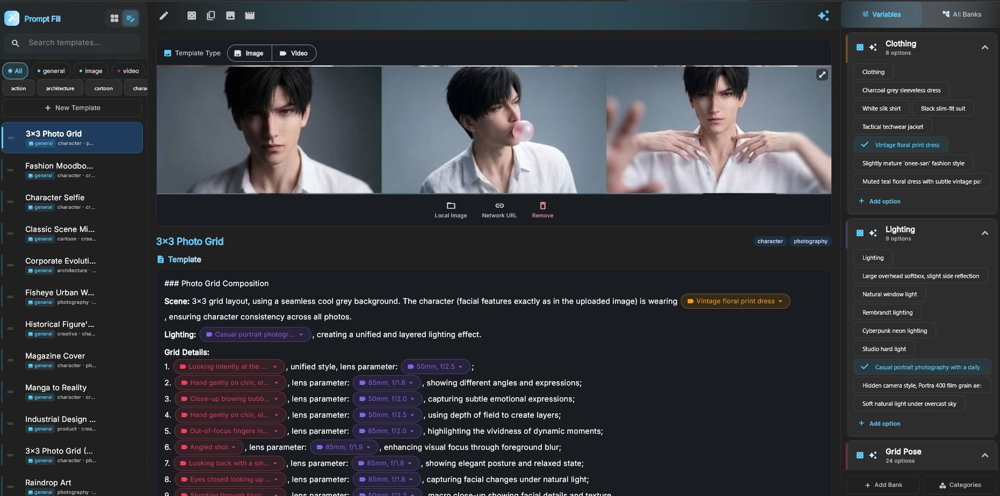
## Configuration

### Config File Location
- **Windows**: `C:\Users\<username>\Documents\ai_prompt_assistant\data\config.json`
- **macOS**: `~/Documents/ai_prompt_assistant/data/config.json`
- **Linux**: `~/Documents/ai_prompt_assistant/data/config.json`

### Data Storage Structure
```
ai_prompt_assistant/
├── data/
│   ├── config.json                    # User settings
│   ├── system_prompts.json            # Custom prompts
│   └── conversations/                 # Saved chats
│       └── *.json
├── temp_images/                       # Uploaded images
└── temp_videos/                       # Uploaded videos
```

## Recommended Models

### Local Models (Ollama/LM Studio)
- **Llama JoyCaption Alpha One** (12GB VRAM) - Best for system prompt builder
- **Gemma 3 27B** (24GB VRAM) - High quality, complex scenes
- **Gemma 3 12B** (8GB VRAM) - Balanced performance
- **Qwen2.5-VL-7B** (8GB VRAM) - Excellent detail and instruction following
- **LLaVA 1.6** (8GB VRAM) - Popular open-source option

### Google Gemini & Imagen Models (Cloud)
- **imagen-4.0-generate-001** - Latest Imagen 4 model for photorealistic results
- **gemini-3-pro-image-preview** - High-quality reasoning + image generation
- **gemini-3-flash-image-preview** - Fast, lightweight image generation
- **gemini-2.5-flash-image** - Efficient and reliable image creation
- **gemini-3-flash-preview** - Fast text/vision analysis
- **gemini-3-pro-preview** - Best quality text/vision analysis

## Advanced Features

### Ollama Keep-Alive
- **-1**: Use server default
- **0**: Unload immediately after response
- **Positive number**: Keep loaded for N seconds

### LM Studio Model Unloading
Enable "Unload model after response" to automatically free VRAM after each generation (requires `lms` CLI tool in PATH).

### Video Processing (Google)
1. Video is uploaded to Google Files API with resumable protocol
2. Processing status polled every 2 seconds (5-minute timeout)
3. Once ACTIVE, video URI is included in generation request
4. Supports: mp4, avi, mov, mkv, webm, flv, wmv, m4v

### Streaming Responses
- Real-time token-by-token display
- Automatic `<think>...</think>` tag filtering
- Concurrent streams for multiple models
- Auto-scroll to latest content

### FFmpeg Engine & Video FX
- **Automatic Setup**: Automatically downloads `ffmpeg.exe` for Windows on first run to the application support directory.
- **Last Frame Extraction**: Uses FFmpeg to accurately extract the final frame of a video for use as a starting point for extensions.
- **Seamless Merging**: Concatenates multiple video segments into a single file while preserving audio and ensuring consistent timestamps.
- **Audio Preservation**: Intelligently handles audio tracks during video extensions to maintain professional quality.

## Troubleshooting

### "Connection refused" error
- Verify the API provider is running and accessible
- Check the base URL and port number
- Test with `curl http://localhost:PORT/api/tags` (Ollama) or `/v1/models` (others)

### "No models available"
- Click "Fetch Models" after starting the API server
- For LM Studio: Load at least one model in the UI first
- For Koboldcpp: Launch with `--port 5001 --usecublas` or similar

### Video upload fails
- Google only: Verify API key is correct
- Check video file size (large files may exceed quota)
- Ensure video format is supported
- Check Google Cloud console for quota limits

### Slow generation
- Local models: Reduce model size or enable GPU acceleration
- Google: Check API rate limits and billing
- Try selecting fewer models for concurrent execution
- Local Enhancer video modes with audio enabled are slower than visual-only prompting because they run local speech transcription and audio tagging before final prompt generation

### Images not loading
- Verify file permissions in temp_images directory
- Check supported formats: png, jpg, jpeg, webp
- Try re-uploading the image

### Local Enhancer video prompt has no audio details
- Audio understanding only runs for **Local Enhancer Qwen video modes** (`V2V`, `VT2V`, `V2I`, `VT2I`)
- Use **Qwen3.5-4B Abliterated** or **Qwen3.5-9B Abliterated** in the Local Enhancer provider
- Retry with a short clip that has clear, loud speech or obvious background audio
- Check the Python API log for `Failed to decode audio`, `Failed to transcribe audio`, or `Failed to classify audio events`
- On first use, wait for the one-time Whisper / CLAP downloads to finish

## Development

### Run Tests
```bash
flutter test
```

### Code Generation
```bash
# Generate json_serializable code
flutter pub run build_runner build

# Watch mode for development
flutter pub run build_runner watch
```

## Architecture

- **State Management**: Provider pattern with ChangeNotifier
- **HTTP Client**: Dio for streaming SSE responses and multipart uploads
- **Video Processing**: FFmpeg (via `ffmpeg_kit_flutter` and raw CLI) for frame extraction and concatenation
- **Media Playback**: `media_kit` for cross-platform video preview and thumbnails
- **File I/O**: path_provider for cross-platform directories
- **Serialization**: json_serializable for type-safe JSON
- **Desktop Integration**: window_manager for window control
- **Theming**: Dynamic Material 3 color schemes generated from multiple seed palettes, with light / dark / system mode support

## License

This application is **partially open-source**.

- The core framework, UI components, and general integrations are open-source.
- Certain advanced features, custom AI prompt configurations, and proprietary modules may be closed-source or subject to specific usage restrictions.

Please refer to individual file headers or contact the repository owner for detailed licensing information, commercial usage, and distribution rights.

## Support

For issues, feature requests, or contributions, please visit the GitHub repository.
