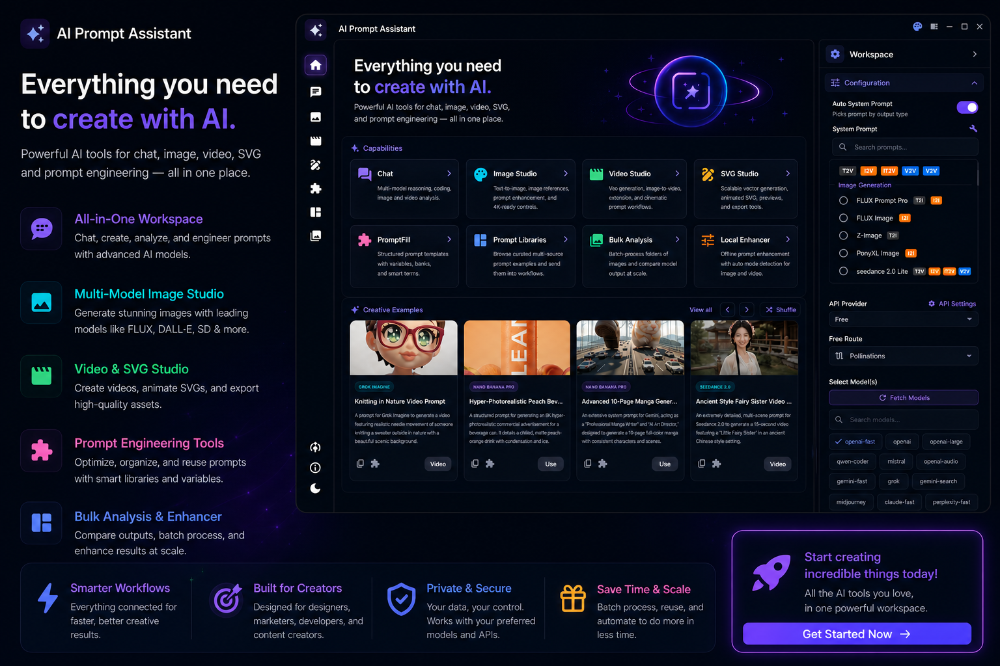
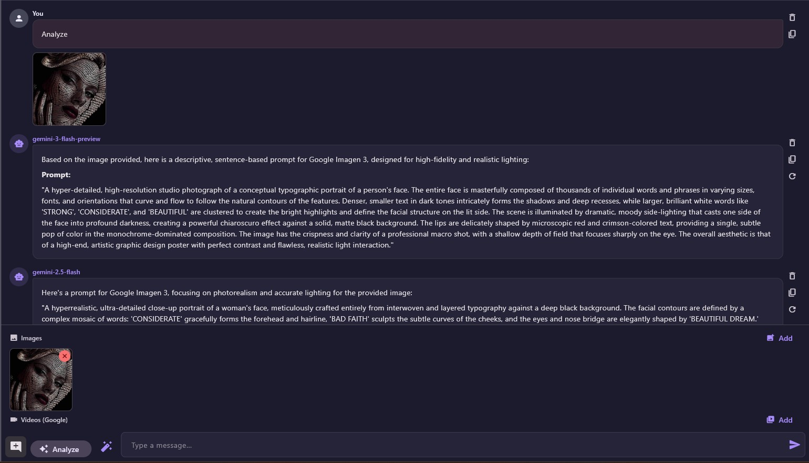
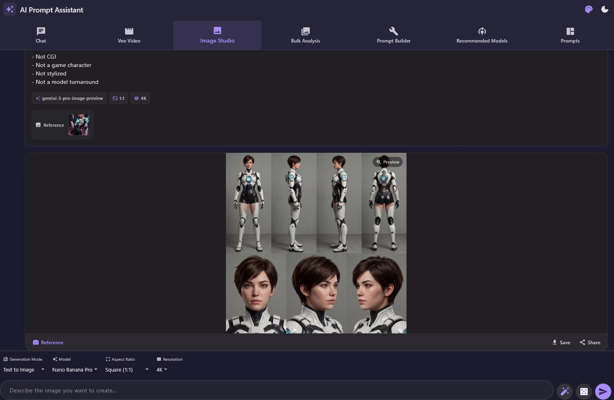
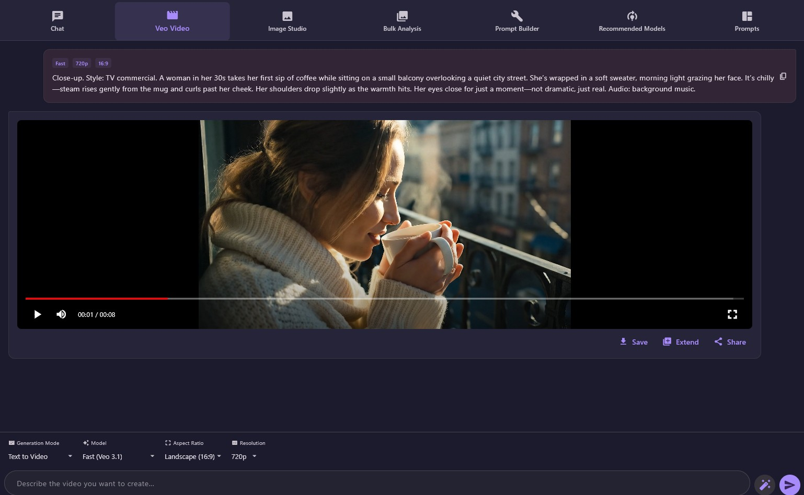
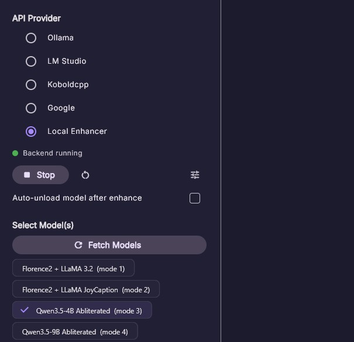
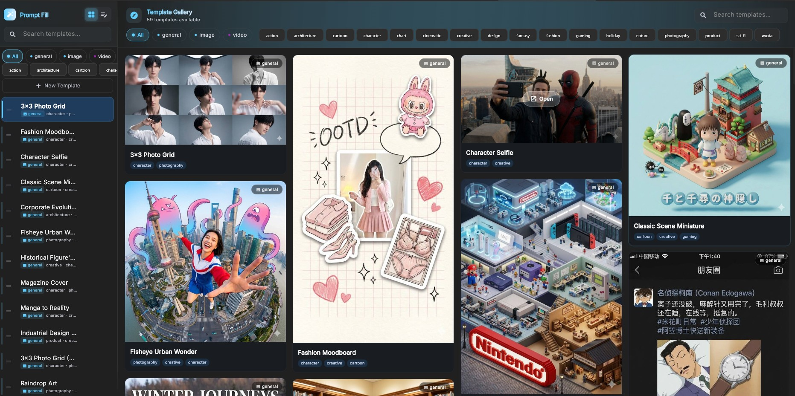
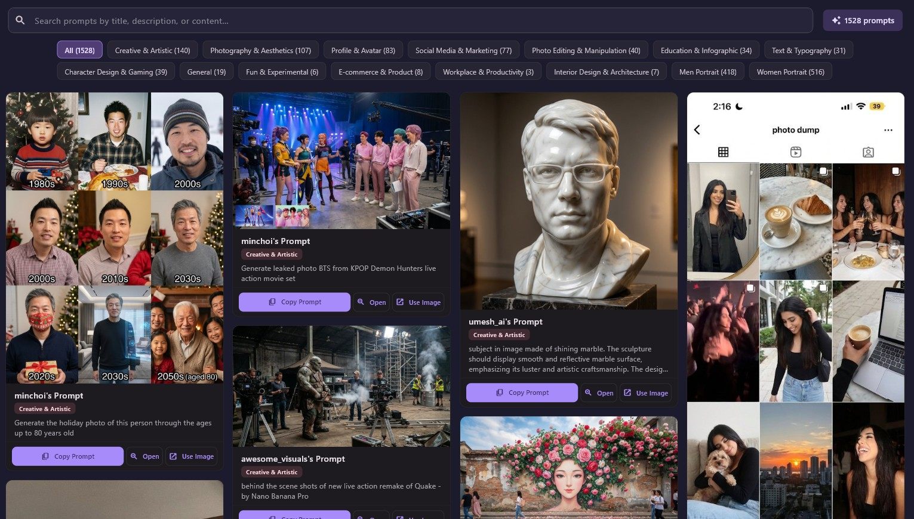
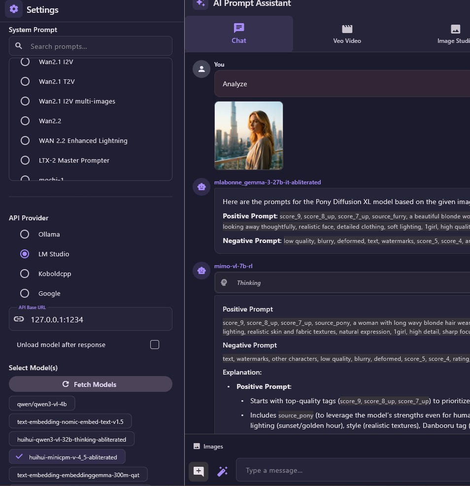

# AI Prompt Assistant

AI Prompt Assistant is a Flutter desktop app for building, improving, analyzing, and generating AI prompts with images, video, local models, cloud APIs, and guided agent skills.

[Try the online demo](https://ai-prompt-assistant-web.vercel.app/) | [Download releases](https://github.com/rorsaeed/ai-prompt-assistant-pro/releases) | [Release notes](WHATS_NEW.md) | [Quick start](QUICKSTART.md)



## What You Can Do

- Chat with one or more AI models at the same time.
- Co-create and refine prompts interactively using an editable belief graph and clarifying questions.
- Analyze images and videos, including batch image folders.
- Generate and edit images with Gemini / Imagen-style workflows.
- Generate, extend, and merge videos with Veo / Google Video FX workflows.
- Improve raw ideas into structured prompts, cinematic prompts, or JSON prompt payloads.
- Run built-in agent skills for video, animation, and web-to-video workflows.
- Use free routes, local providers, cloud providers, or any OpenAI-compatible endpoint.
- Keep conversations, prompt libraries, templates, media, and skill sessions organized locally.

## Latest Release: v1.4.0

Version `1.4.0+1` introduces the Interactive Proactive Co-Creator prompt pipeline, a unified API Settings configuration studio, local prompt library seeding, and enhanced agent workflow tools.

- **Interactive Proactive Co-Creator** — Deconstruct prompt concepts into an editable belief graph (entities, attributes, relationships) and answer dynamic clarifying questions to co-create and refine high-quality prompts.
- **Unified API Settings Studio** — Easily configure base URLs, API keys, and visibility toggles for all local, cloud, and gateway providers (Ollama, LM Studio, Koboldcpp, Gemini, OpenAI, Anthropic, Mistral, OpenRouter, Together, Groq, SwiftRouter, NVIDIA NIM, and the Free Provider) in a clean dashboard.
- **Offline Prompt Library Seeding** — Automatically bundles and initializes trending prompt libraries (Nano Banana, Seedance 2.0, Grok Imagine) from local assets for instant availability.
- **Media Download Support** — Save preview videos and images from prompt galleries directly to your local storage.
- **Agent Workflow Upgrades** — Re-run agent executions starting from specific tasks, override session models, and retry failed terminal commands inline.
- **Vertex AI Gemini 3.5 Flash** — Added support for Gemini 3.5 Flash vision workflows.

See [WHATS_NEW.md](WHATS_NEW.md) for the full release history.


## Feature Overview

### Providers

| Provider | Best for | Notes |
| --- | --- | --- |
| Free | Zero-configuration chat and experimentation | Uses public relay routes such as Groq, Ollama, Pollinations, Nvidia, and Gemini. No API key required. |
| Local Enhancer | Offline prompt rewriting with bundled GGUF models | Downloads the llama.cpp runtime and selected model assets on first use. |
| Ollama | Local chat and vision models | Default URL is `http://localhost:11434`. |
| LM Studio | Local OpenAI-compatible models | Default URL is `http://localhost:1234`. |
| Koboldcpp | Local GGUF inference | Default URL is `http://localhost:5001`. |
| Google Gemini | Image, video, and vision workflows | Supports Google Files API video upload and image/video generation features. |
| OpenAI, Anthropic, Mistral | Cloud chat, reasoning, and multimodal models | API keys are configured in the app. |
| OpenRouter, Groq, Together, SwiftRouter, NVIDIA | Hosted gateways and OpenAI-compatible APIs | Base URLs and keys are configurable. |
| Custom providers | Any compatible endpoint | Add OpenAI-compatible local servers or hosted gateways from API Settings. |

### Core Workflows

- **Chat** - Stream responses, compare multiple selected models, attach media, regenerate replies, and save conversations.
- **Proactive Co-Creator** - Deconstruct prompt concepts into an editable belief graph (entities, attributes, relationships) and answer clarifying questions to generate high-quality refined prompts iteratively.
- **Image analysis** - Upload one or more images with drag and drop, then extract captions, tags, structured descriptions, or generation prompts.
- **Video analysis** - Upload videos through Google-compatible workflows with resumable uploads and status polling.
- **Bulk analysis** - Process whole image folders and optionally write sidecar prompt files next to each image.
- **System Prompt Builder** - Generate prompts from 11 caption types, 30 length choices, 25 extra options, and 57 predefined prompts.
- **Prompt Director Pro** - Build model-aware image and video prompts with controls for style, camera, lighting, composition, world, and motion.
- **Prompt to JSON** - Convert casual prompt ideas into structured JSON payloads with a synthesized `master_prompt`.
- **Conversation management** - Save, search, export, rename, delete, and organize chats with nested folders.



### Image Studio

Image Studio supports text-to-image and image-to-image generation with model-specific controls.

- Text-to-image generation from detailed prompts.
- Reference-image workflows for style, composition, or content guidance.
- One-click **Surprise Me** prompt generation.
- **Use as Reference** for iterative image variations.
- Aspect ratios: `1:1`, `16:9`, and `9:16`.
- Resolution controls for supported models: `1K`, `2K`, and `4K`.
- Integrated Gemini 3 Pro, Gemini 2.5 Flash, and Imagen 4 style model flows.



### Veo Video Generation

The Veo workflow is built for cinematic video prompts and iterative video creation.

- Text-to-video generation.
- Image-to-video generation with start and end frames.
- Video extension by extracting the final frame and generating a continuation.
- Automatic FFmpeg download and setup on Windows for frame extraction and merging.
- Prompt enhancement using attached images and extracted video frames.
- Aspect ratio and resolution controls, including `16:9`, `9:16`, `720p`, `1080p`, and `4K` where supported.



### Local Enhancer

Local Enhancer is a self-contained provider for prompt rewriting.

- No Python, Ollama, or external model server required.
- Downloads model assets and llama.cpp runtime automatically on first use.
- Supports modes such as T2V, T2I, T2T, I2V, IT2V, I2I, IT2I, V2V, VT2V, V2I, and VT2I.
- Can automatically choose the best enhancement mode based on attached media and desired output type.
- Includes controls for max tokens, temperature, top-p, seed, video analysis FPS, and llama.cpp runtime version.
- Supports audio-aware video prompting for compatible Gemma 4 workflows, with graceful fallback to visual-only prompting.



### Skills

The Skills screen lets you run guided agent workflows from inside the app.

- Built-in skills: HyperFrames, GSAP, HyperFrames CLI, HyperFrames Registry, Website to HyperFrames, and Remotion.
- Add more skills by pasting an `owner/repo` value, a GitHub repository URL, or a URL to a skill folder.
- Each session can have its own workspace, attachments, and command approval policy.
- Requirement checks help detect tools such as Node.js or FFmpeg before the agent starts.
- Plan-and-execute mode gives longer tasks a visible plan before commands are run.

### PromptFill Template Studio

PromptFill support is adapted from [Prompt Fill](https://github.com/TanShilongMario/PromptFill) by [@TanShilongMario](https://github.com/TanShilongMario).

- Browse imported categories, banks, and templates.
- Fill inline variable chips from bank terms, local options, or custom values.
- Generate context-aware variable suggestions with Smart Terms.
- Convert plain prompts into reusable variable templates with AI Smart Split.
- Maintain image and video preview media for templates.



### Prompt Libraries

The Libraries tab brings several prompt sources into one searchable browser.

- Sources include Nano Banana Pro, Seedance 2.0, GPT Image 1.5, SeeDream 4.5, Gemini 3, and Grok Imagine.
- Search by title, description, or prompt body.
- Filter by source-specific groups and categories.
- Copy prompts, preview cards, or send prompts into PromptFill.



### SVG Generator

- Generate static SVGs from text.
- Generate animated SVGs with CSS `@keyframes`.
- Attach a reference image for vector recreation.
- Export as SVG, PNG, GIF, APNG, MP4, or MOV.
- Preview animated SVGs in the browser for smoother playback.

## Install

### For Users

1. Open the [latest GitHub release](https://github.com/rorsaeed/ai-prompt-assistant-pro/releases).
2. Download one of the Windows packages:
   - `Installer_Win_X64.exe` for the standard installer.
   - `ai_prompt_assistant.zip` for a portable build.
3. Install or extract the app.
4. Launch `ai_prompt_assistant.exe`.

The **Free** provider works without an API key. Cloud providers require their own API keys. Local Enhancer and built-in skills install required assets automatically when first used.

### For Developers

Prerequisites:

- Flutter SDK 3.0 or later.
- Windows, macOS, or Linux desktop support enabled.
- Optional local providers: Ollama, LM Studio, or Koboldcpp.
- Optional cloud provider API keys.

Setup:

```bash
git clone https://github.com/rorsaeed/ai-prompt-assistant-pro.git
cd ai-prompt-assistant-pro
flutter pub get
```

Run:

```bash
flutter run -d windows
flutter run -d macos
flutter run -d linux
```

Build:

```bash
flutter build windows --release
flutter build macos --release
flutter build linux --release
```

## First Run

1. Open the sidebar.
2. Choose an API provider.
3. Configure the provider:
   - `Free` works immediately.
   - Local providers need a running local server and base URL.
   - Cloud providers need an API key.
   - Custom providers need an OpenAI-compatible base URL.
4. Click **Fetch Models**.
5. Select one or more models.
6. Choose or create a system prompt.
7. Attach images or videos when needed, then send a message.



## Common Workflows

### Analyze Images

1. Select a provider and model that supports vision.
2. Attach one or more images.
3. Choose a system prompt or create one with System Prompt Builder.
4. Send a message or click **Analyze Image(s)**.
5. Compare outputs if multiple models are selected.

### Generate Images

1. Open **Image Studio**.
2. Pick a model.
3. Choose text-to-image or image-to-image mode.
4. Set aspect ratio and resolution.
5. Write a prompt, use **Surprise Me**, or enhance with the wand button.
6. Generate, then optionally reuse an output as a reference.

### Generate or Extend Video

1. Open the **Veo** tab.
2. Choose text-to-video, frame-to-video, or extend-video mode.
3. Attach start/end images or an input video when needed.
4. Enhance the prompt with the wand button.
5. Generate the video.
6. Use **Extend** on an output to continue the scene.

### Run a Skill

1. Open **Skills**.
2. Choose a built-in skill or **Auto**.
3. Create a session and choose a working directory.
4. Attach files if useful.
5. Describe the task.
6. Review command approvals as the skill runs.

### Use PromptFill

1. Open **PromptFill**.
2. Select a template.
3. Click variable chips to choose values.
4. Use Smart Terms for AI-generated options.
5. Preview or edit template media.
6. Copy the completed prompt or send it into a generation workflow.

## Configuration

User data is stored in the documents folder:

| Platform | Config path |
| --- | --- |
| Windows | `C:\Users\<username>\Documents\ai_prompt_assistant\data\config.json` |
| macOS | `~/Documents/ai_prompt_assistant/data/config.json` |
| Linux | `~/Documents/ai_prompt_assistant/data/config.json` |

Typical storage layout:

```text
ai_prompt_assistant/
|-- data/
|   |-- config.json
|   |-- system_prompts.json
|   `-- conversations/
|       `-- *.json
|-- skills/
|-- skills_workspace/
|-- temp_images/
`-- temp_videos/
```

## Recommended Models

### Local Models

- **Llama JoyCaption Alpha One** - Strong image-to-prompt and captioning model.
- **Gemma 3 27B** - High-quality reasoning for complex scenes.
- **Gemma 3 12B** - Balanced local performance.
- **Qwen2.5-VL-7B** - Strong detail extraction and instruction following.
- **LLaVA 1.6** - Popular open-source vision option.

### Cloud and Gateway Providers

- **OpenAI** - GPT, reasoning, image, and multimodal workflows.
- **Anthropic** - Claude chat models.
- **Mistral** - Mistral chat models and supported image tooling.
- **Google Gemini / Imagen** - Vision, image generation, and video workflows.
- **OpenRouter, Groq, Together, SwiftRouter, NVIDIA** - Hosted model gateways with model availability controlled by each provider.

## Troubleshooting

### Connection Refused

- Confirm the local model server is running.
- Check the provider base URL and port.
- Test the endpoint directly, for example `curl http://localhost:11434/api/tags` for Ollama.

### No Models Available

- Click **Fetch Models** after the provider is running.
- For LM Studio, load a model in LM Studio first.
- For API-key providers, verify the key and account access.
- For custom providers, confirm the endpoint exposes an OpenAI-compatible `/v1/models` response.

### Cloud Request Fails

- Confirm the selected provider has an API key saved in API Settings.
- Verify the selected model is available for that account or gateway route.
- Check rate limits, billing, regional availability, and provider status.

### Video Upload or Generation Fails

- Google video workflows require a valid Google API key and supported file type.
- Large files may exceed quota or timeout.
- Check that FFmpeg is available when extending or merging video segments.

### Local Enhancer Fails to Start

- Check the `local_enhancer_<model>_<timestamp>.log` file in the system temp directory.
- Try updating the llama.cpp runtime version from Local Enhancer Settings.
- Delete the cached runtime under `%LOCALAPPDATA%\ai_prompt_assistant\local_enhancer\runtime` and restart.

## Development

Run tests:

```bash
flutter test
```

Run code generation:

```bash
dart run build_runner build --delete-conflicting-outputs
```

Watch code generation:

```bash
dart run build_runner watch --delete-conflicting-outputs
```

### Project Structure

```text
lib/
|-- main.dart
|-- models/
|-- providers/
|-- screens/
|-- services/
|-- theme/
|-- utils/
`-- widgets/
```

Important areas:

- `lib/services/api_client.dart` - Multi-provider API access and streaming.
- `lib/services/local_enhancer_runtime.dart` - Managed llama.cpp runtime.
- `lib/services/video_generation_service.dart` - Google Video FX workflow.
- `lib/services/video_utils.dart` - FFmpeg operations.
- `lib/services/skill_*` - Skill discovery, execution, prerequisites, attachments, and caching.
- `lib/providers/*` - App state via `ChangeNotifier`.
- `lib/screens/*` - Main desktop screens.

### Architecture

- **Framework**: Flutter desktop.
- **State management**: Provider and `ChangeNotifier`.
- **HTTP**: Dio with streaming support.
- **Local inference**: Managed llama.cpp subprocess.
- **Video processing**: FFmpeg CLI.
- **Media playback**: `media_kit`.
- **Persistence**: Local JSON and SQLite where appropriate.
- **Serialization**: `json_serializable`.
- **Theming**: Material 3 color schemes with light, dark, and system modes.

## License

This application is partially open-source.

- The core framework, UI components, and general integrations are open-source.
- Certain advanced features, prompt configurations, and proprietary modules may be closed-source or subject to additional restrictions.

Refer to individual file headers or contact the repository owner for commercial usage and distribution questions.

## Support

For bugs, feature requests, or contributions, use the GitHub repository issues and discussions.
